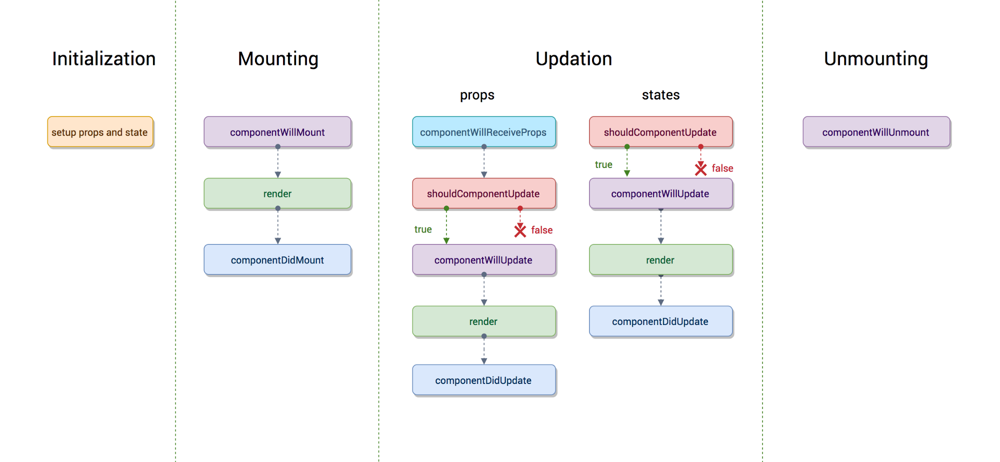

# React vulnerabilities.

# Objectius

# Introducció

Per poder parlar sobre vulnerabilitats sobre un sistema és imprescindible conèixer com funciona aquest sistema. Per aquest motiu abans d'entrar en detalls sobre possibles errades de seguretat crec convenient explicar les bases del funcionament de una aplicació react. 

En aquest document es parlarà de React anomenant-lo framework ja que té moltes similituds amb la definició de framework però voldria deixar clar que reactjs **no és un framework**, és un conjunt de llibreries que aporten funcionalitat extra al llenguatge de programació javascript. En general cada llibreria és un conjunt d'instruccions en javascript. 

S'ha de tenir en compte també que les noves versions de javascript incorporen molt de codi asíncron i que la majoria d'accions poden ser programades de manera concurrent. És un ús molt habitual de les noves versions dels llenguatges de programació, facilita l'atomització de les accions en mètodes que poden executar-se en paral·lel per així aprofitar en la seva totalitat el potencial de la màquina.

# Javascript

Javascript no és un llenguatge orientat a objectes i aquest fet ens pot jugar en contra a l'hora de protegir accessos a memòria de l'aplicació, en llenguatges de programació com Java o C# els accessos als objectes estan gestionats a partir del propi llenguatge de programació. Juntament amb els accessos hi ha una important desaventatge referent a la programació orientada a objectes, i és que en javascript és més fàcil que el codi "vingui brut", és a dir, perdre la consistència del disseny. Aquest fet pot propiciar que a la llarga, desenvolupaments que ja han estat validats quedin desprotegits degut al mal ús del programari. 

# Com funciona react (JSX)

React és un conjunt de llibreries de desenvolupament programades en javascript. ReactJS està pensat per el desenvolupament d'interfícies d'usuari. Està mantingut per Facebook però el seu codi és opensource i també hi colaboren desenvolupadors a nivell individual de tot el món. 

El funcionament d'una aplicació react és mitjançant la descàrrega d'una aplicació (web o nativa) feta "en essència" en javascript, més endavant ja es desvelarà per què es diu "en essència", a una màquina client per poder ser utilitzada independentment del servidor (a nivell de funcionalitat). Aquest fet s'ha desenvolupat així com a millora del món del desenvolupament pensant en microserveis. 

Es separa completament la interfície d'usuari de les dades fent que el sistema d'usuari sigui totalment autònom i que gestioni per complert la sol·licitació de les mateixes en els diferents moments que ho requereixi. La sol·licitud es gestiona a partir de la capa d'aplicació sobre el protocol http/s. Normalment 
es fan servir API web services o fins i tot es podria utiltizar connexions web socket també sobre http/s. 

la construcció de les aplicacions react tant de mòbil com web utilitzen la mateixa metodologia de desenvolupament tal com es comentarà més endavant a l'apartat **"Objectes importants"**. 

## Gestor de paquets

Npm [2] és el gestor de paquets per excel·lència de javascript. Aquí s'hi poden trobar tots els components necessaris per poder desenvolupar funcionalitats dins de la nostre app, ja sigui web o nativa. 

## Patró principal del llenguatge de programació. 

React es basa en el patró de disseny desenvolupament anomenat composite [3]. Aquest patró es basa en l'anomenat divideix i venç, la idea principal és dividir les funcionalitats més bàsiques i aïllables en mòduls que a la seva vegada son utilitzats per altres mòduls que els componen. Així doncs es genera un arbre de dependències molt clar peró a la vegada perillós. Aquest concepte és clau a l'hora de parlar dels objectes importants i les seves característiques que poden fer-los vulnerables. 

{ width=350px}

Com podem apreciar en el diagrama planteja l'esquema d'un arbre.

## Objectes importants

En el desenvolupament de react hi aparèixen certs actors imprescindibles per el seu funcionament. El patró composite permet que la creació de les pàgines sigui àgil i que els components no depenguin els uns dels altres. Així mateix permet que els components tinguin l'habilitat d'executar codi javascript des de les fulles de l'arbre de dependències. 

**Tots els objectes presentats a continuació existeixen tant en el desenvolupament d'aplicacions web com en el desenvolupament d'aplicacions natives.**

### Components

Els components son el què en POO s'anomenen objectes. React aplica una capa per sobre de javascript i gestiona certs fitxers amb una estructura concreta com si fossin objectes, la diferència principal amb un llenguatge de programació a objectes és la consistència que t'aporta i l'accés als recursos de memòria privats. ReactJS s'executa en un navegador o en una aplicació mòbil, en el cas de l'aplicació com ja explicarem més endavant, la gestió d'aquesta protecció es deriva al sistema operatiu peró en cas d'una web, la gestió sobre l'accés als recursos de memòria de react els gestiona el mateix navegador amb el risc que aixó comporta.

Així mateix un exemple d'un component react pot ser qualsevol conjunt d'elements html o de vistes en android que componguin aquest component. 

En instagram, cada una de les publicacions d'instagram son components que es mostren dins d'un component llista. I cada component publicació té components interns com pot ser el share, els like (actualment ja morts), entre altres.

### State (redux)

React empra l'ús de redux [4] per a la gestió del que s'anomena l'estat. El concepte d'estat surt primàriament del concepte de màquina d'estats. Hem de visualitzar cada component descrit en l'apartat anterior com una màquina d'estats on l'interacció amb aquest component des dels múltiples punts d'interacció pot alterar aquest estat i fer que la màquina viatgi a l'estat següent provocant canvis en la visualització del mateix. 

L'estat és un dels punts crítics en la seguretat i la protecció de dades sensibles d'una aplicació feta en react però lligat amb un mal disseny en la obtenció de les dades. Com s'ha comentat anteriorment les dades de l'aplicatiu no han d'estar a la aplicació client sinó que l'aplicació client ha d'anar a buscar-les mitjançant una API Rest, GraphQL, SOAP o un web socket allà on siguin mitjançant la deguda autenticació si és que fa falta. 

L'espai de memòria destinat a fer perdurar aquestes dades que ha recuperat dins del navegador al llarg del temps és l'estat. Així doncs si l'accés a aquestes dades fa que s'exposin dades d'altres clients o dades sensibles degut a una mala programació i disseny de l'aplicatiu i el seu sistema, l'estat és el punt atacable. 

### Props

Cada component per poder funcionar requereix de paràmetres, com a mínim requereix el paràmetre estat generat per el component pare App(), punt d'entrada de l'aplicació. Les props es defineixen com un objecte json, quan el component pare les reb s'inicialitzen i tot seguit, per cada component intern se li assignen aquestes props. Tots els components tenen el mateix comportament i per tant les props acaben viatjant des de la part superior de l'arbre fins a les fulles. 

A l'objecte props s'hi poden assignar tant valors, com altres objectes, com funcions. Aquesta és una de les virtuts del Javascript, i és que permet la creació molt fàcil de funcions d'ordre superior. El fet que desenvolupar sigui fàcil degut a aquestes característiques no treu que també és un punt dèbil a l'hora de pensar en la seguretat del sistema.

### Lifecycle

ReactJS així com tots els UI frameworks utilitza el que s'anomena un cicle de vida. El cicle de vida es posa en marxa quan es sol·licita la creació d'un component, en aquest moment s'entra a la inicialització on es crea l'objecte estat i es generen les anomenades props. El el següent diagrama s'escenifica amb claretat els diferents mètodes que s'executen per cada component de react. 

{ width=350px }

Per defecte cada una d'aquestes funcions no actúen, simplement es criden, el component super() que és el pare genèric de tots els components cedeix la interfície sobre la qual s'implementa el cicle de vida per tal que tots els components sobreescriguin els mètodes i realitzin al seu interior totes les accions que considerin oportunes. 

La funció render és la més important, ja que és on s'executa el codi JSX [5], llenguatge de templates utiltizat per react. Aquesta funció és executada no només en el cicle de vida de la creació, també en els cicles de vida d'actualització, tant si es canvia el valor de les props com si es canvia el valor de l'estat. 

# Vulnerabilitats 

Tenint en compte que ara ja sabem com actúa react, ja podem parlar més concretament de vulnerabilitats lligades a aquest sistema. Es parlarà de vulnerabilitats de react, aquestes vulnerabilitats no només estan subjectes a aplicacions web sinó també a les aplicacions react-native. Per definició, react deixa poques portes obertes, però per molt consistent i seguir que es vulgui crear un software, quan passa per les mans dels programadors, sempre té possibilitats de tornar-se insegur. El bad coding és un fet. 

- FONT : https://medium.com/dailyjs/exploiting-script-injection-flaws-in-reactjs-883fb1fe36c1
- Mirar les vulnerabilitats de components de npm
- Mirar vulnerabilitats de l'estat vers la programació (boolean variables per amagar apartats que no hauria de veure, mala programació) 
- Mirar vulnerabilitats de redux -> https://snyk.io/vuln/npm:redux
- XSS -> http://danlec.com/blog/xss-via-a-spoofed-react-element
- Denial of service : https://snyk.io/test/github/facebook/react-native?tab=issues
- Getting data from cache : https://stackoverflow.com/questions/9916829/how-do-i-view-android-application-specific-cache

# Conclusions

# References 

- [1] - [ReactJS] -> [https://es.reactjs.org/](https://es.reactjs.org/)
- [2] - [NPM] -> [https://www.npmjs.com/](https://www.npmjs.com/)
- [3] - [Composite pattern] -> [https://es.wikipedia.org/wiki/Composite_(patr%C3%B3n_de_dise%C3%B1o)](https://es.wikipedia.org/wiki/Composite_(patr%C3%B3n_de_dise%C3%B1o))
- [4] - [Redux] -> [https://es.redux.js.org/](https://es.redux.js.org/)
- [5] - [JSX] -> [https://es.reactjs.org/docs/introducing-jsx.html](https://es.reactjs.org/docs/introducing-jsx.html)